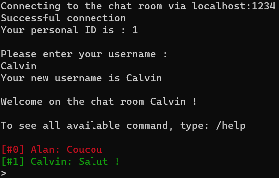
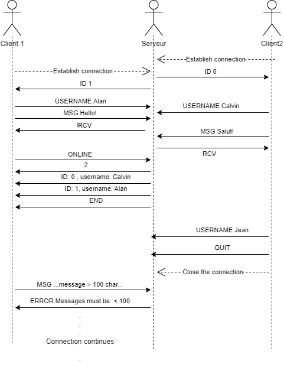

# practical-work-2 - DAI
#### By Alan Sottile & Calvin Graf | HEIG-VD | 27.11.2023

## Description

Our application enables users to connect to a chatroom via a server so that they can communicate with each other.

The various functions of our programme are as follows:

- Send a message
- View people online
- Change username
- Leave the chatroom

## How to use it ?

Using our application is very simple. 

#### Step 1
First of all, go to the "practical-work-2\src\main\java" folder. Inside the "java" folder, you should find the "pw2" folder.

#### Step 2
You will need to open a terminal there and compile the server. To do this, enter the following command : 

> *javac pw2/ServerTCP.java*

Once the server has been compiled, you can start it with this command :

> java pw2/ServerTCP

#### Step 3
Now that our server is ready, we can connect a user to our chatroom. Open a second terminal in the same location and enter the command to compile the client:

> javac pw2/ClientTCP.java

Then connect to the server with :

> java pw2/ClientTCP

Congratulations, you are now connected to your chatroom! If you want to add other users to the chatroom (limited to a maximum of 10), simply open new terminals and enter the same command as in step 3 (the second one).

## Usage

Now that you're logged in, you need to choose your username. Several people can have the same one. Your user name must contain between 1 and 15 characters. If you insert spaces, they will not be taken into account.

Once this has been done, you now have access to the chatroom. Sending a message is very simple, just write what you want in the terminal and press the "Enter" key. Everyone connected will receive your message.

Your message is preceded by your ID and username. Each customer has their own colour assigned according to their ID.

### Commands

#### Getting help

The first command simply provides a list of available commands and their functions. Just type "**/help**" in the chatroom.

#### Change username

If you want to change your username, you can do so using the "**/username**" command.

#### See the people currently connected

If you want to see the users connected to the chatroom, type "**/online**".

A list of connected people containing their ID and user name will be displayed.

#### Exit the application

If you wish to close the chatroom, you can enter the command "**/quit**". Please note that the messages you have sent and received will not be displayed again if you join the chatroom again.

## Chatroom application protocol
 
### Overview
Our protocol allows the transfer of messages between multiple client via a server. It's a multi-threaded client/server protocol
 
The client connects to a server if there is still enough room in the chatroom. He writes his name and can start sending commands or messages.
 
If the client has sent a message, the server will store it in a text file, which will be emptied at the next server reboot.
 
If the client has sent a command, the server will interpret it and will send back the right information.
 
The server will return an error if a problem has been detected.
 
### Transport protocol
 
Our protocol uses the TCP protocol on the port 1234.
 
The client and server must be on the same network.
 
The server must be turned on, the client will then establish a connexion with the server.
 
The connexion is closed whenever the client closes the window, uses /quit, CTRL+C or when the server closes the window.
 
### Messages
The client can send the following messages:
 
-  USERNAME ***< new username >*** : Used when the user wants to change his username. ***< new username >*** contains the new username. The username cannot be empty or multiple concecutive spaces.
-  ONLINE : Used when a user wishes to return the number and list of user currently online.
- QUIT: Used to close connection with the server
- MSG ***< message >*** : Used when the user wishes to send a message. ***< message >*** contains the message.
 
The server can send the following messages:
- ID ***< ientifiant new client >*** : Used to inform the client that the connection has been successful  ***< id new client >***  contains the id assignated to the new client.
- RCV: Used when the reception of a message has been successful
- CHATROOM_FULL: Used to inform the new user that the connection couldn't have been made because the chatroom is full.
- END: Used to signal the end of the user list when the client has requested an ONLINE.
- ERROR ***< error message >*** : sent when an error has been encountered. an error can currently only occur if the client sends a message longer than 100 chars.
 
 
### Exemples
Here's a use cases showing the different behavior possibile while using the protocol:
 

 
As the use-case shows, the ID is given by increasing order of available IDs.
 
Every client constantly read the textfile and update the display, the server will send a RCV if the message has been received and added to the textfile, and an ERROR if there has been an issue while sending the message.
 
When an ONLINE is sent, the server send the number of online client and then the list.
 
When an client QUIT, it will close the connection from the client side.
 
When there is an ERROR if a message couldn't be sent, it won't close the connection and the both can keep on using the protocol.